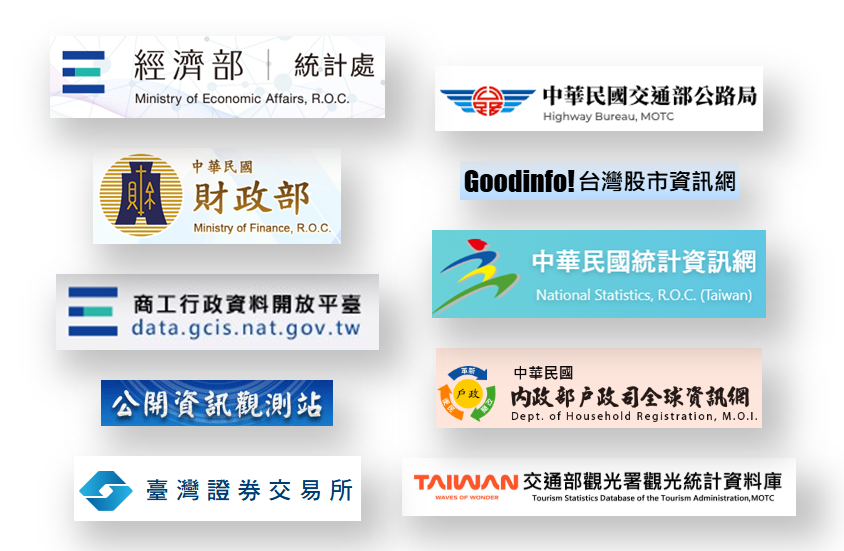
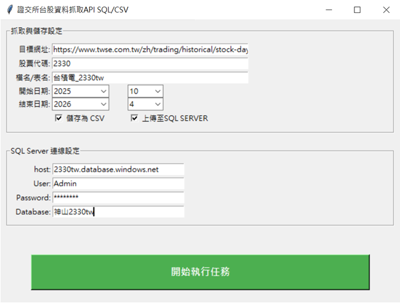
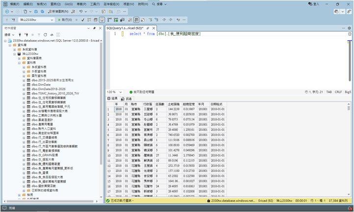
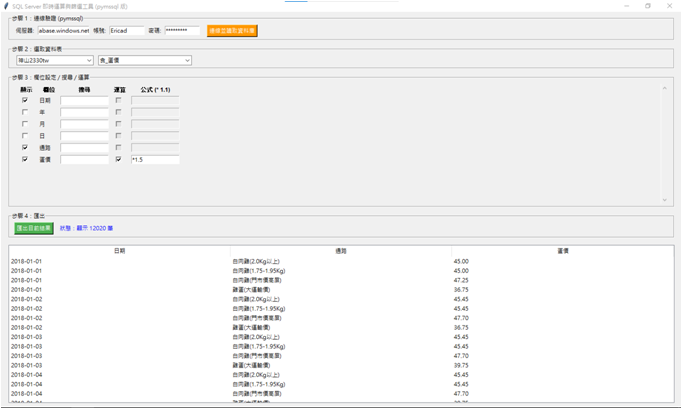
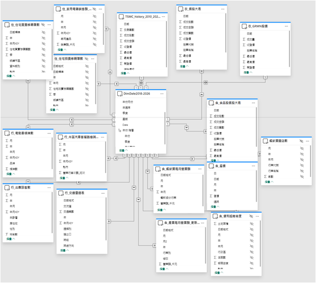
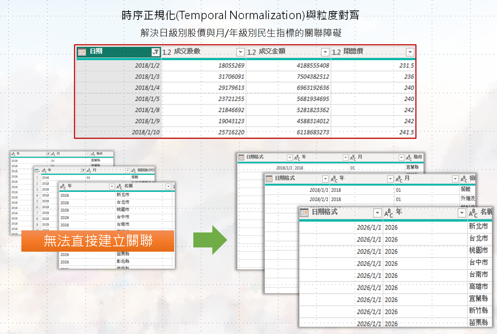
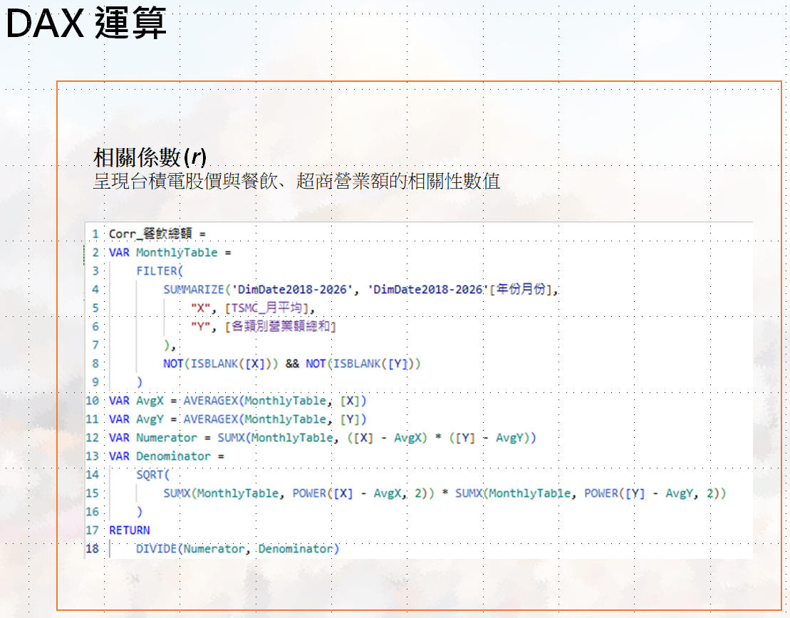
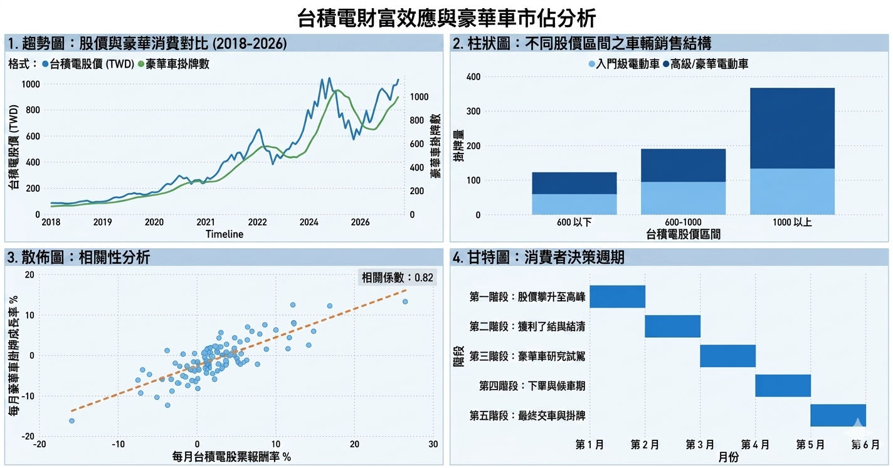

# 神山下的民生圖譜-
# 台積電股價對台灣食衣住行的相關性研究-以食行為例(衣住分析中)

本專案資料抓取→ETL→POWER BI圖表呈現→資料內容分析及結果。

## 📂 專案內容

### 1. 數據資料抓取
* **TSMC_2330股價** 的完整股票資料。
* **公開資料平台及網站** 的資料抓取(食衣住行)。
* **Python**：Selenium、Requests。

### 2. 資料清洗ETL
## 🛠 使用技術與工具
* **EXCEL**：資料基本處理。
* **Python**：Pandas。
* **SQL語法、DAX語法**：資料二次清洗。
* **Azure SQL SERVER**：雲端資料庫架設及使用。
* **SQL SERVER資料篩選自製工具**：資料挑選匯出。

### 3. 資料呈現與分析
* **POWER BI**：資料圖表呈現。
* **資料分析**：資料趨勢分析及預測。

## 圖表核心分析與說明

該圖表旨在探討台灣半導體龍頭台積電 (TSMC) 的股價表現與豪華車市場（特別是電動車）之間的連動性，即所謂的「財富效應」。
## 1. 趨勢對比：股價帶動消費
長期正相關： 觀察 2018 年至 2026 年（預測值）的數據，豪華車掛牌數（綠線）與台積電股價（藍線）呈現高度同步。
領先指標： 股價通常略微領先車市表現，這反映出投資者在股市獲利後，約有數個月的延遲才會轉化為大額實體消費。
## 2. 銷售結構：高股價支撐高客單價
消費升級： 隨著股價突破 1000 TWD 大關，豪華車的銷售總量顯著增加。
電動車佔比： 在高股價區間（Above 1000），**高級/豪華電動車（深藍色）**的佔比明顯高於入門級，顯示高淨值族群對於頂規電車的強勁需求。
## 3. 統計相關性：強烈的線性關係
相關係數 (R) = 0.82： 在統計學上，這屬於極高相關性。這意味著台積電每月的投資報酬率表現，能有效解釋並預測該月豪華車登記數量的成長動能。
## 4. 消費者行為：從獲利到交車
決策週期（約 5-6 個月）：

第 1-2 月： 股價攀升，投資者進行獲利回吐（Cash Out）。
第 3 月： 開始進入賞車、試駕的資訊蒐集階段。
第 4-6 月： 由於豪華車通常有待車期，從下單到最終掛牌（Registration）約需 2 至 3 個月的流程。

觀察重點： > 該分析暗示了台積電股價不僅是科技業的風向球，更已成為台灣內需高端消費市場的重要經濟動力源。當股價穩定在千元以上時，豪華電動車市場的成長潛力將最為巨大。

